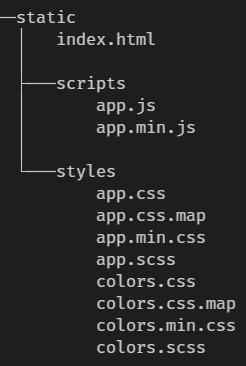

# web-ui

**Build your own Web-Frontend without a framework from scratch by using CSS, HTML and Javascript natively**

As a web designer I often combine many different skills and disciplines to create a visually appealing and easy-to-use Web-Frontend.
During the design process it's necessary for me to prototype new ideas without having dependence to a certain framework.

**Table of Contents**

- [Goals](README.md#goals)
- [Installation](README.md#installation)
- [Steps to start](README.md#steps-to-start)

## Goals

- Provide a **basic** and **extensible** foundation to create prototypes.
- **No dependencies** to fancy frameworks - Learn what is really needed and how it works under the hood.
- **Self-hosting** server written in Go - Embed all the files needed into the binary.

## Installation

**From source**
    git clone https://github.com/andygeiss/web-ui
    cd web-ui

**Windows**
    make.bat

**Unix**
    make

## Steps to start

Open this project in with [Visual Studio Code](https://code.visualstudio.com/).

The [static](static) folder contains the whole frontend with its assets.

File [index.html](static/index.html) defines the structure by using HTML.

File [app.js](static/scripts/app.js) implements the logic by using JavaScript.

File [app.scss](static/styles/app.scss) contains the styling by using Sass.
File [colors.scss](static/styles/app.scss) contains example colors by using Sass.

The Sass files could be compiled to CSS by using [Live Sass Compiler](https://marketplace.visualstudio.com/items?itemName=ritwickdey.live-sass).

The JavaScript and CSS files could be minimized by using [JS & CSS Minifier](https://marketplace.visualstudio.com/items?itemName=olback.es6-css-minify)

The frontend could also be displayed by using [Live Server](https://marketplace.visualstudio.com/items?itemName=ritwickdey.LiveServer).

